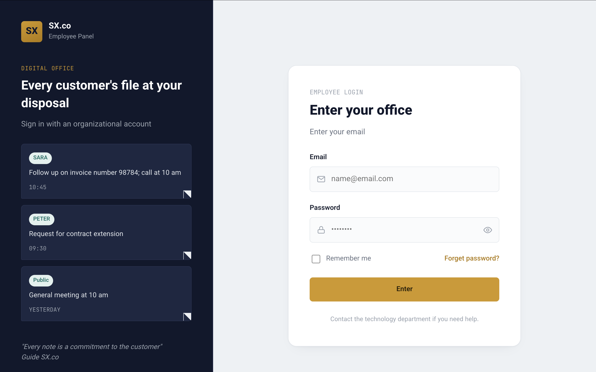
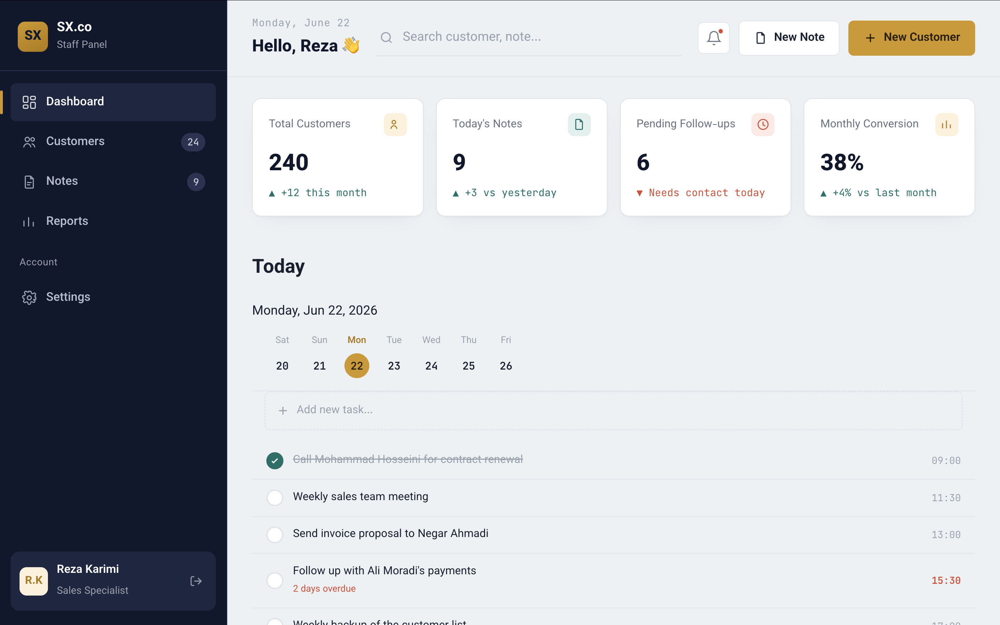
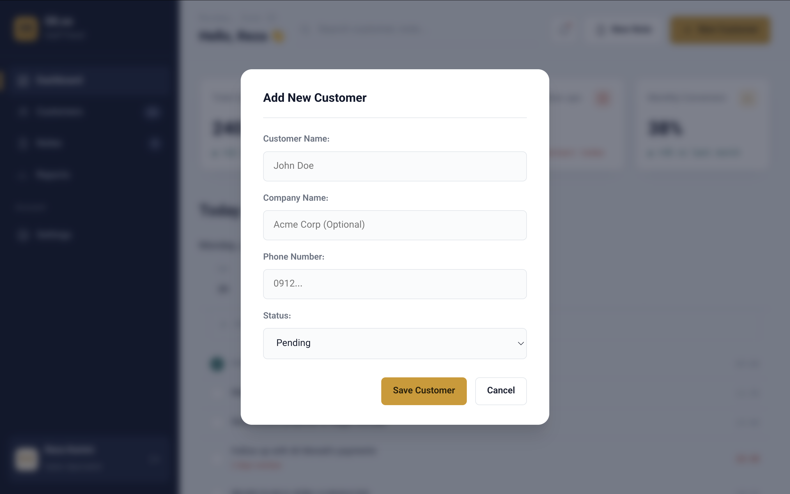

# 🏢 Employee CRM & Task Management System

A Django-based **Employee Management Panel** designed for internal company use.  
Employees can manage customers, tasks, and daily notes in a simple and efficient dashboard.

---

## 🚀 Features

- 🔐 Employee login & authentication system  
- 👥 Add / edit / delete customers  
- 🗂 Customer management dashboard  
- 📝 Daily notes system for employees  
- 📌 Task tracking and personal workflow management  
- 📊 Simple and clean admin-style interface  

---

## 🛠️ Tech Stack

- Python 🐍  
- Django 🌐  
- SQLite / MySQL  
- HTML, CSS, Bootstrap 🎨  
- Git & GitHub  

---

## 📸 Screenshots

### 🔑 Login Page


---

### 📊 Dashboard


---

### 📝 Add Note Feature


---

## 📂 Project Structure

sx_co/
├── manage.py
├── sx_co/
├── app/
├── templates/
├── static/
├── screenshots/
│   ├── login.png
│   ├── dashboard.png
│   ├── add_note.png
└── db.sqlite3

---

## 🎯 Project Goal

This project was built as a **real-world practice CRM system** to simulate an internal company tool.  
It helps employees manage:

- Customer data  
- Personal notes  
- Daily tasks and workflow  

The goal of this project is to strengthen backend development skills using Django and understand real-world system design.

---

## ⚙️ Installation & Setup

```bash
# Clone repository
git clone https://github.com/AliAshrafi99/sx.co-CRM.git

# Move into project directory
cd sx.co-CRM

# Create virtual environment
python -m venv venv

# Activate environment
source venv/bin/activate  # Mac/Linux
venv\Scripts\activate     # Windows

# Install dependencies
pip install -r requirements.txt

# Run migrations
python manage.py migrate

# Start server
python manage.py runserver

👨‍💻 Developer

Ali Ashrafi
Python | Django Developer

⸻

📌 Notes

* This project is still under development
* More features like analytics, role-based access, and reporting will be added
* Designed as a portfolio project for backend development showcase